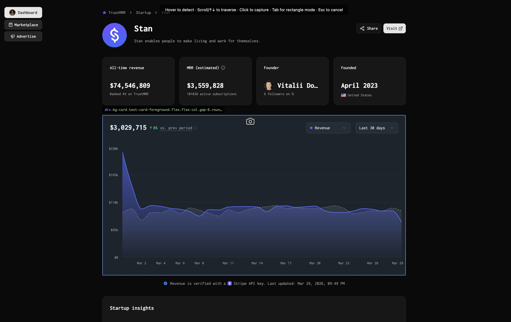
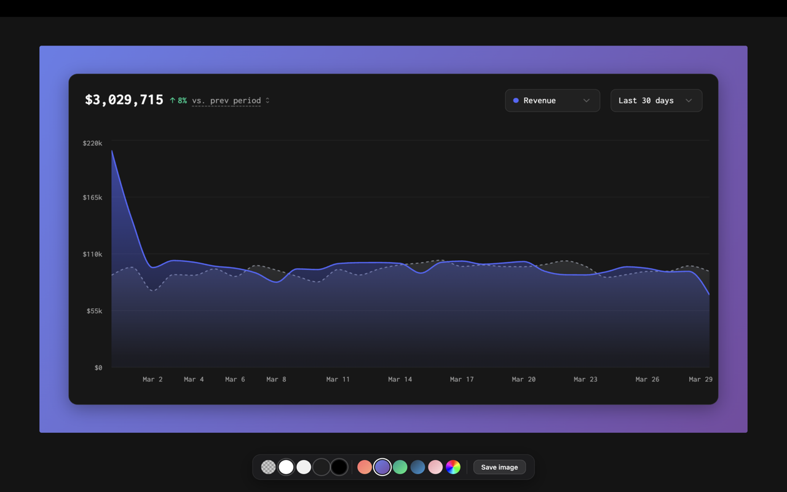

# Webcap

A browser extension (Chrome and Safari) for capturing screenshots of web page regions or individual components, with a built-in editor for adding backgrounds before saving.

## Features

- **Component mode** - Hover over any element to detect it. Scroll or use arrow keys to expand/narrow the selection. Captures include a drop shadow with rounded corners.
- **Rectangle mode** - Click and drag to select any area on the page.
- **Background editor** - Choose from solid colors, gradient presets, or a custom color picker before saving your capture.
- **Keyboard shortcuts** - Fast access to both modes, DOM traversal, and mode switching.

## Screenshots

### Component Mode

### Editor

## Installation

### Chrome Web Store

[Install Webcap from the Chrome Web Store](https://chromewebstore.google.com/detail/webcap/hiofbhgfmcaiohmbdlajagfbhkikpcim)

### Manual (Chrome Developer Mode)

1. Clone this repository
2. Open `chrome://extensions` in Chrome
3. Enable "Developer mode" (top right)
4. Click "Load unpacked" and select the `extension/` directory inside this repo

### Safari (macOS)

The same source files are wrapped as a Safari Web Extension via an Xcode project under `safari/`.

1. Clone this repository
2. Open `safari/Webcap/Webcap.xcodeproj` in Xcode
3. Select the `Webcap` scheme and run (`⌘R`)
4. In Safari, open **Settings → Advanced** and enable **Show features for web developers**
5. Open **Settings → Developer** and enable **Allow unsigned extensions** (required while running an unsigned local build; this resets when Safari quits)
6. Open **Settings → Extensions** and enable **Webcap**
7. Bind keyboard shortcuts under **System Settings → Keyboard → Keyboard Shortcuts → App Shortcuts** if desired (Safari doesn't honor `suggested_key` from `manifest.json`)

The Xcode project references the JS/CSS/HTML files in `extension/` directly, so editing them rebuilds both the Chrome and Safari versions from the same source.

## Keyboard Shortcuts

| Shortcut | Action |
|---|---|
| `Cmd+Shift+E` / `Ctrl+Shift+E` | Component capture |
| `Cmd+Shift+S` / `Ctrl+Shift+S` | Rectangle capture |
| `Tab` | Switch between modes |
| `Arrow Up/Down` | Expand/narrow selection (component mode) |
| `Arrow Left/Right` | Navigate siblings (component mode) |
| `Scroll` | Expand/narrow selection (component mode) |
| `Enter` | Capture selected component |
| `Esc` | Cancel |

## Privacy

Webcap runs entirely in your browser. It does not collect any data, make any network requests, or require any account.